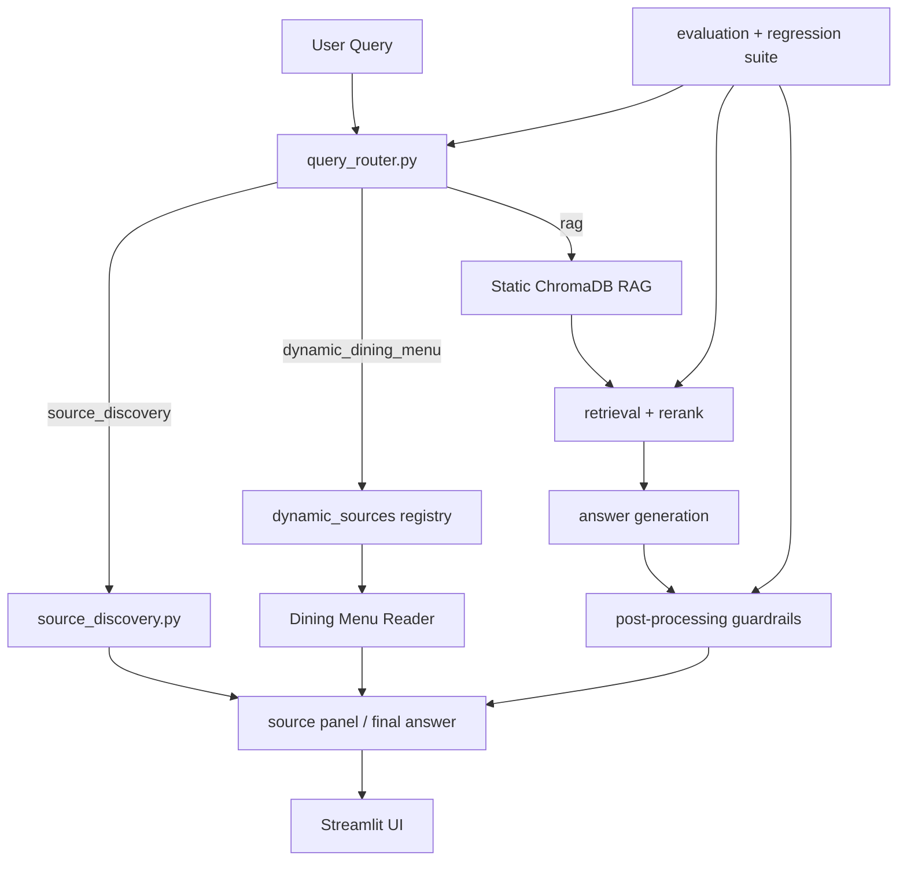

# Architecture Overview

## Genel Bakış

Selçuk RAG Asistan, Streamlit arayüzünden gelen kullanıcı sorularını önce routing katmanında sınıflandırır, ardından kaynak keşfi, dinamik kaynak veya static ChromaDB RAG akışlarından birine yönlendirir. Sistem final cevabı kullanıcıya göstermeden önce post-processing ve guardrail katmanlarından geçirir.

## Query Flow



Routing sırası korunur:

1. Source Discovery Mode
2. Dynamic Dining Menu Reader
3. Normal RAG

## Query Router

`query_router.py`, cevap modunu tek noktadan seçer. Intent fonksiyonlarını yeniden yazmaz; `source_discovery.py` ve `dynamic_menu_reader.py` içindeki mevcut intent yardımcılarını kullanır.

Desteklenen mode değerleri:

- `source_discovery`
- `dynamic_dining_menu`
- `rag`

## Static ChromaDB RAG

Static RAG akışı mevcut `chroma_db/` snapshot üzerinde çalışır.

Son doğrulanmış snapshot:

- 157 unique source
- 3092 document/chunk
- `source_type_counts`: web PDF ve web page kaynakları

Canlı ortamda ingestion çalıştırılmaz. Snapshot güncellemesi ayrı prosedürle yapılır ve `docs/CHROMADB_SNAPSHOT_PROCEDURE.md` takip edilir.

## Source Discovery Mode

Source discovery, kullanıcı bilgi cevabı değil kaynak listesi istediğinde devreye girer.

Örnekler:

- `Staj yönergesi var mı?`
- `Teknoloji Fakültesi staj kaynakları nelerdir?`
- `Kütüphane hakkında hangi belgeler var?`

Bu mod normal LLM cevap zincirine girmeden mevcut indekslenmiş kaynakları listeler. Kaynak yoksa kaynak uydurmaz.

## Dynamic Sources Registry

`dynamic_sources/` klasörü dinamik kaynak reader'ları için ortak interface ve registry sağlar.

Şu an kayıtlı reader:

- `dining_menu`

Yeni dynamic source eklenecekse query router önceliği ve source discovery çakışmaları ayrıca test edilir.

## Dining Menu Reader

Yemekhane menüsü günlük/aylık değişen dinamik veri olduğu için ChromaDB snapshot içine gömülmez. `dynamic_menu_reader.py` ve `dynamic_sources/dining_menu.py` endpoint'i dar kapsamda okur.

Davranış:

- Menü güvenilir parse edilirse kullanıcıya gösterilir.
- Bugüne uygun satır yoksa veya parse güvenilir değilse fallback verilir.
- Menü içeriği uydurulmaz.

Faz 10A ile reader tarihli ve haftalık sorguları gün bazlı ele alır:

- `4 Mayıs yemekte ne var?` gibi sorgularda yalnızca ilgili gün seçilir.
- `Bu hafta yemekhane menüsü ne?` sorgusunda en fazla ilgili haftanın günleri listelenir.
- Belirsiz `Pazartesi menüsü ne?` gibi sorgularda birden fazla eşleşme varsa tarih istenir.
- `Öğün Yok` günleri yemek uydurmadan açıkça belirtilir.
- Tarih menü aralığı dışındaysa mevcut tarih aralığı söylenir.

Bu tarih seçimi ChromaDB'ye yazmaz; menü verisi dynamic source olarak okunmaya devam eder.

## Retrieval / Rerank

`rag_engine.py`, `retrieval_rerank.py` ve `retrieval_normalization.py` şu sinyalleri birlikte kullanır:

- query normalization
- Turkish/ASCII-lite matching
- document aliases
- article number/title metadata
- expected term support
- legal/source-specific relevance filtering

Son doğrulanmış retrieval metrikleri:

- `document_hit_at_1`: 0.967741935483871
- `document_hit_at_3`: 1.0
- `article_hit_at_1`: 0.6451612903225806
- `article_hit_at_3`: 0.7419354838709677
- `fallback_accuracy`: 1.0
- `critical_failure_count`: 0

## Answer Generation ve Guardrails

Final cevap katmanı:

- model-generated source block temizler,
- URL sızıntılarını temizler,
- inline citation ekler veya korur,
- düşük kaliteli cevapları fallback'e çeker,
- birebir tekrar eden cümleleri dar kapsamda azaltır,
- kaynakta açık olmayan operasyonel bilgi ve terim eşdeğerliklerini uydurmaz.

AGNO/GANO gibi terimlerde evidence içinde açık eşdeğerlik yoksa sistem temkinli cevap verir.

## Answer Grounding Evaluation

`evaluation/evaluate_answer_grounding.py`, final cevapların doğru evidence'a dayanıp dayanmadığını CI-safe evidence-only modda ölçer.

Kontrol edilen sinyaller:

- route/mode doğruluğu
- kaynak keyword eşleşmesi
- belge keyword eşleşmesi
- madde/article sinyali
- expected terms
- forbidden terms
- fallback davranışı

Son doğrulama:

- 42 question
- 42 passed
- 0 failed
- critical_failure_count: 0

## Regression Suite

`evaluation/run_regression_suite.py` sık kullanılan evaluation ve test komutlarını profile-based runner altında toplar.

Profiller:

- `fast`
- `full`
- `dynamic-source`
- `snapshot-update`

Normal local doğrulama:

```bash
python evaluation/run_regression_suite.py --profile full --use-local-chroma-copy
```

## ChromaDB Local Runtime Copy

Local evaluation sırasında tracked `chroma_db/chroma.sqlite3` dosyasının kirlenmesini azaltmak için `chroma_runtime.py` local copy stratejisi sağlar.

```bash
python evaluation/run_regression_suite.py --profile full --use-local-chroma-copy
```

Bu mod `.local_chroma_runtime/` altında geçici kopya kullanır. Snapshot update ve ingestion işleri bu modu kullanmaz.

## HF Deploy Workflow

GitHub Actions workflow:

- `main` push/merge ile çalışır.
- HF deploy klasörünü temiz hazırlar.
- ChromaDB snapshot dosyalarını Git LFS ile Hugging Face Space'e taşır.
- `HF_TOKEN` secret olarak kullanılır.
- Token veya API key dosyaya yazılmaz.

Workflow dosyası: `.github/workflows/deploy-hf-space.yml`

## Güvenlik / Kapsam Kuralları

- `.env`, API key, token ve secret dosyaları commit edilmez.
- `data/*.pdf` ve `data/manual_pdfs/` commit edilmez.
- Local artifact dosyaları (`*.local.json`, `*.local.md`) commit edilmez.
- ChromaDB snapshot yalnız açık snapshot update görevlerinde değiştirilir.
- Provider/model/dependency değişiklikleri ayrı riskli faz olarak ele alınır.
- Sistem resmi belge yerine geçmez; kritik kararlar resmi kaynakla doğrulanmalıdır.
