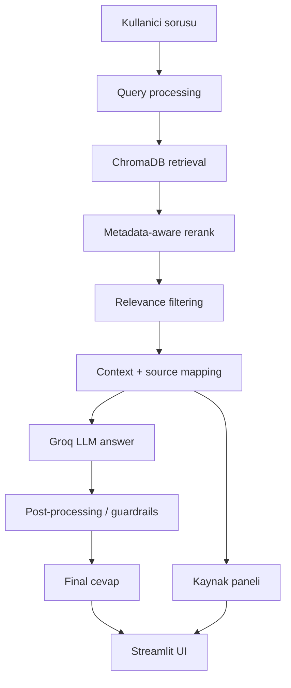

# Architecture Overview

## Genel Bakis

Selcuk RAG Asistan, Streamlit arayuzu uzerinden gelen sorulari ChromaDB snapshot icindeki resmi kaynaklarla eslestirir. Retrieval ve rerank sonrasinda LLM cevap uretir; cevap final kullaniciya gosterilmeden once post-processing ve guardrail katmanindan gecer.

## Akis Diyagrami

## Runtime Katmani

| Katman | Dosya / Teknoloji | Gorev |
| --- | --- | --- |
| UI | `app.py`, Streamlit | Chat arayuzu, kaynak paneli, admin alani |
| RAG engine | `rag_engine.py` | Retrieval, prompt, streaming cevap, fallback |
| Rerank | `retrieval_rerank.py` | Metadata-aware rerank ve legal/source sinyalleri |
| Normalization | `retrieval_normalization.py` | Turkce/ASCII-lite matching, alias ve madde eslesmesi |
| Vector DB | `chroma_db/`, ChromaDB | Runtime snapshot |
| LLM | Groq | Cevap uretimi |

## ChromaDB Snapshot

`chroma_db/` klasoru runtime bilgi tabanidir. Mevcut snapshot:

- 149 unique source
- 2985 chunk/document

Canli ortamda ingestion calistirilmez. Snapshot HF deploy sirasinda Git LFS ile tasinir. Guncelleme proseduru icin `docs/CHROMADB_SNAPSHOT_PROCEDURE.md` takip edilir.

## Source Binding ve Guardrails

`prepare_context_and_sources` ayni sirayla hem LLM context icindeki `[1]`, `[2]` kaynak numaralarini hem de UI kaynak panelini hazirlar.

Final cevap katmaninda:

- model-generated source block temizlenir,
- URL listesi sizintisi engellenir,
- inline citation korunur,
- citation yoksa uygun durumda `[1]` eklenir,
- dusuk kaliteli cevaplar fallback'e cekilir,
- operasyonel/guncel bilgi sorularinda kaynak yoksa uydurma cevap verilmez.

## Evaluation Katmani

Evaluation dosyalari runtime davranisini degistirmez; kaliteyi olcmek icin kullanilir.

| Dosya | Amac |
| --- | --- |
| `evaluation/run_general_smoke.py` | Genel retrieval/source filtering smoke |
| `evaluation/evaluate_retrieval.py` | Golden retrieval metrikleri |
| `evaluation/triage_retrieval_failures.py` | Retrieval failure triage |
| `evaluation/audit_article_metadata.py` | Madde metadata audit |
| `evaluation/audit_source_inventory_aliases.py` | Source inventory alias audit |
| `evaluation/evaluate_answer_quality.py` | Sinirli answer quality evaluation |
| `evaluation/compare_llm_providers.py` | Provider/model comparison |

Local artifact dosyalari `.gitignore` kapsamindadir ve commit edilmez.

## Deploy Katmani

GitHub Actions workflow:

- `main` push/merge ile calisir.
- Temiz HF deploy klasoru olusturur.
- HF README frontmatter uretir.
- ChromaDB snapshot dosyalarini Git LFS ile ekler.
- HF Space main branch'ine force push yapar.

Workflow dosyasi: `.github/workflows/deploy-hf-space.yml`

## Quality Dashboard Katmani

`quality_dashboard.py` Streamlit admin alaninda read-only kalite paneli sunar.

Panel:

- ChromaDB health bilgisini gosterir.
- Local evaluation artifact ozetlerini okur.
- Shell command calistirmaz.
- API key/secret gostermez.
- Raw answer preview gostermez.

## Guvenlik Sinirlari

- `.env`, API key, token ve secret dosyalari commit edilmez.
- `data/*.pdf` commit edilmez.
- Local evaluation artifact dosyalari commit edilmez.
- Provider comparison production provider'i degistirmez.
